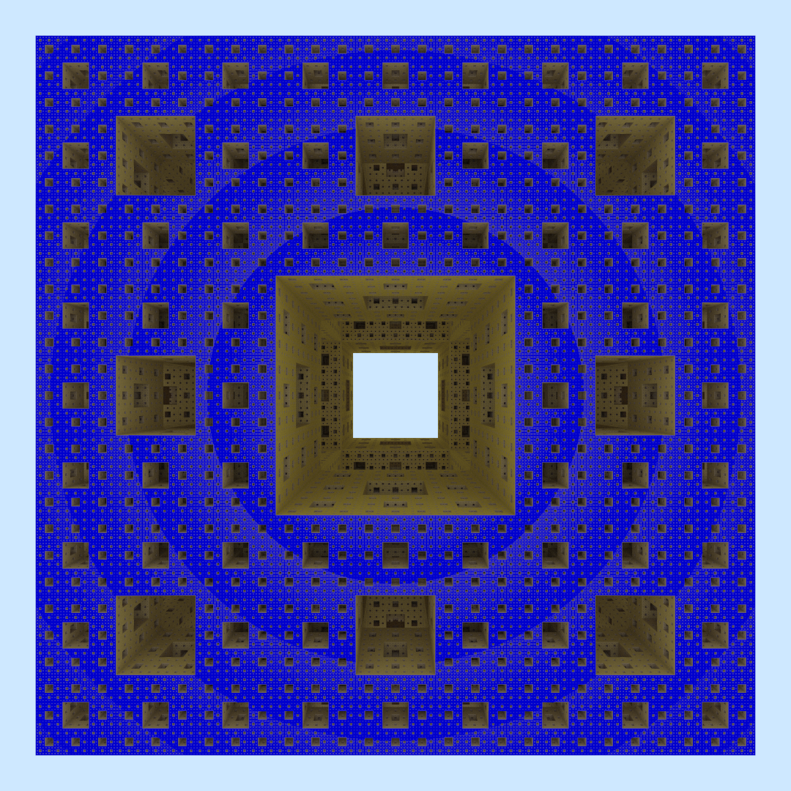

`cuda-sdf` performs naive path tracing of a signed distance field (SDF) using
ray marching, accelerated with CUDA. The below one-megapixel image displays the
Menger sponge, with a thousand samples and up to 80 bounces, generated in about
150 seconds on an RTX 2070. Note that the RTX ray shooting capabilities cannot
be not used, as the geometry is implicitly defined.

## Performance

A naive implementation (`generate_pixel_naive`), where each thread is assigned a
pixel and computes all samples for that pixel, computes the above image in about
150 seconds. An alternative implementation (`generate_pixel_regeneration`)
spawns a pool of persistent threads that regenerate paths when they terminate,
reducing the number of idle threads in a warp. This gives an 4.5% decrease in
runtime and a 2% increase in occupancy, as reported by Nsight Compute.

## System requirements and dependencies

Building requires MSVC 2019. The following third-party dependencies are
included:

* [stb](https://github.com/nothings/stb) for writing PNG files.
* `sutil` from the [OptiX](https://developer.nvidia.com/optix) SDK samples for
  random number generation and vector- and matrix math.

## Resources

* _Menger Fractal_  
  Quillez, I. [[link]](https://iquilezles.org/www/articles/menger/menger.htm)  
  This article explains how the Menger fractal can be represented by an SDF.
* _Ray Tracing Gems II: Chapter 14, The Reference Path Tracer_  
  Boksansky, J. and Marrs,
  A. [[link]](https://link.springer.com/book/10.1007/978-1-4842-7185-8)  
  This chapter explains how to create a simple path tracer.
* _Path Regeneration for Interactive Path Tracing_  
  Novák J. et
  al. [[link]](https://diglib.eg.org/handle/10.2312/egsh.20101048.061-064)  
  Explains the concept of path regeneration.