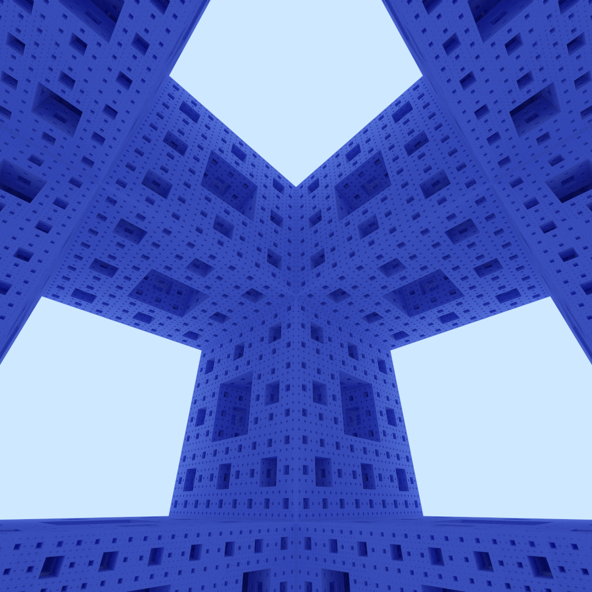

`cuda-sdf` performs naive path tracing of a signed distance field (SDF) using
ray marching, accelerated with CUDA. The below one-megapixel image displays the
Menger sponge, with a thousand samples and up to 80 bounces, generated in about
20 seconds on an RTX 2070. Note that the RTX ray shooting capabilities cannot be
not used, as the geometry is implicitly defined.

## System requirements and dependencies

Building is tested with MSVC, but other compilers should work as well. The
following third-party dependencies are included:

* [stb](https://github.com/nothings/stb) for writing PNG files.
* `sutil` from the [OptiX](https://developer.nvidia.com/optix) SDK samples.

## Resources

* _Menger Fractal_  
  Quillez, I. [[link]](https://iquilezles.org/www/articles/menger/menger.htm)  
  This article explains how the Menger Fractal can be represented by a SDF.
* _Ray Tracing Gems II: Chapter 14, The Reference Path Tracer_  
  Boksansky, J. and Marrs,
  A. [[link]](https://link.springer.com/book/10.1007/978-1-4842-7185-8)  
  This chapter explains how to create a simple path tracer.